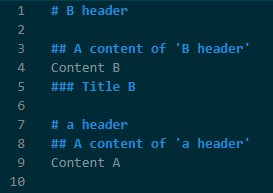
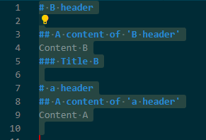
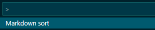
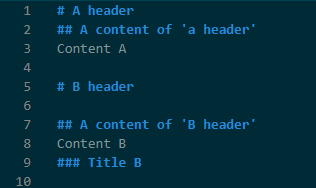

# Markdown sort README

## Sort Markdown file by headings

This extension will sort a whole markdown file using 'level-1' headings as keys for sorting.
- All level-1 headings will be capitalized.
- The content of each section will be untouched.

### Before sorting 

### Select the text you want to sort 

### Run the 'Markdown sort' command from the Command Palette (Ctrl+Shift+P)

### After sorting

> Tip: Many popular extensions utilize animations. This is an excellent way to show off your extension! We recommend short, focused animations that are easy to follow.

## Release Notes

### 1.0.0

Initial release of 'Markdown sort'

---

## Following extension guidelines

Ensure that you've read through the extensions guidelines and follow the best practices for creating your extension.

* [Extension Guidelines](https://code.visualstudio.com/api/references/extension-guidelines)

